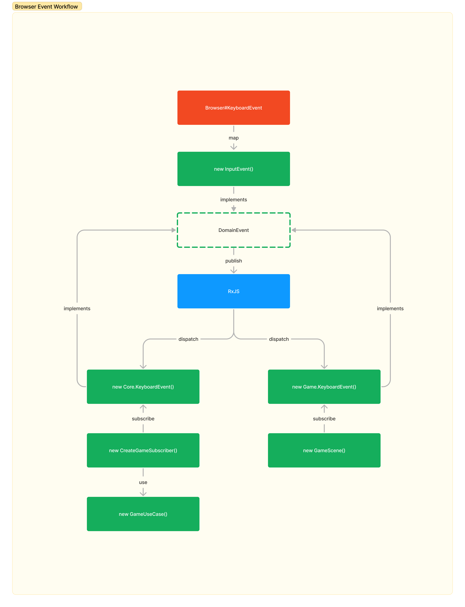

Global Game Jam 2023 - Give a Chance
===

 

## Architecture

We use PIXI.js, RxJS, and InversifyJS to build a Domain-Driven Design and Clean Architecture-based game.

All events should convert to `Domain Event` and use RxJS to publish to each domain. For example, this is a Keyboard from Browser.

## Structure

| Path       | Description                                                 |
|------------|-------------------------------------------------------------|
| `@/assets` | the static assets e.g. image, mp3                           |
| `@/config` | the config for this game included subscriber configureation |
| `@/events` | the interface of Domain Event resued in all domains         |
| `@/utils`  | the helper functions                                        |

### Core Domain

| Path                 | Description                  |
|----------------------|------------------------------|
| `@/core/entities`    | state of game objects        |
| `@/core/repository`  | storage of game state        |
| `@/core/services`    | logic of game                |
| `@/core/usecases`    | behavior of game             |
| `@/core/subscribers` | the public interface of core |

### Game Domain

| Path              | Description                                 |
|-------------------|---------------------------------------------|
| `@/game/scenes`   | the scene similar to usecase                |
| `@/game/entities` | the game object which managed display state |
